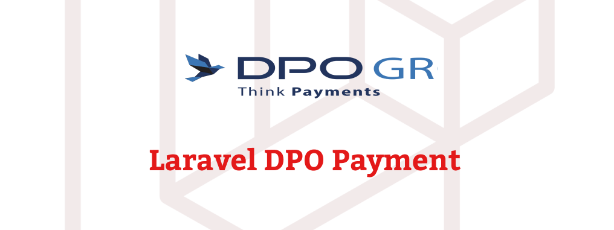

<p align="center"></p>

# Mobile money Payment

[](https://packagist.org/packages/spatie/laravel-permission)
[](https://github.com/spatie/laravel-permission/actions?query=workflow%3ATests+branch%3Amain)
[](https://packagist.org/packages/spatie/laravel-permission)

## What It Does
This package allows you to make payment with the mobile money payment methods.

Once installed you can do stuff like this:


## Changelog

Please see [CHANGELOG](CHANGELOG.md) for more information what has changed recently.

## Contributing

Please see [CONTRIBUTING](https://github.com/spatie/.github/blob/main/CONTRIBUTING.md) for details.

### Testing

``` bash
composer test
```

### Security

If you discover any security-related issues, please email [scotttresor@gmail.com](mailto:scotttresor@gmail.com) instead of using the issue tracker.

You're free to use this package, but if it makes it to your production environment we highly appreciate you sending us a postcard from your hometown, mentioning which of our package(s) you are using.
